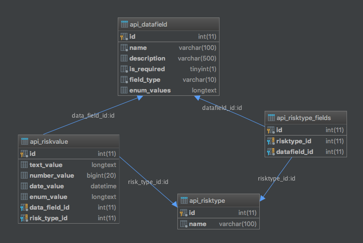

# Challenge

## Technology Stacks

### Back End

- Python
- Django
- Django REST Framework
- MySQL
- Deployment by AWS Lambda and Zappa

### Front End

- Vue.js
- Deployment by AWS S3

## The data challenge

- Because the need of user-defined data so I create a table that to store multiple 
types of data such as text, datetime, int and a special type text in JSON format for enum type.
- Here is the DB diagram

- Tables (python model [here](src/backend/api/models.py))

    - DataField: Define what kind of data and extra information for that field such as
    `name`, `description`, `is_required`
    - RiskType: Define a collection of fields for this Risk Type
    - RiskValue: This table store data for each submission of Risk Type. Each type of data
    will be stored in the specific column for that type. 
    
## The API

- End Point: https://qkm0v73prh.execute-api.ap-southeast-1.amazonaws.com/dev/api/

- List of Risk Type: 

<pre>risk-types/</pre>
    
- Get a Risk Type:

<pre>risk-types/{id}/</pre>

- Admin Page: https://qkm0v73prh.execute-api.ap-southeast-1.amazonaws.com/dev/admin/

## The Web App

- http://zappa-lambda-assets.s3-website-ap-southeast-1.amazonaws.com/
